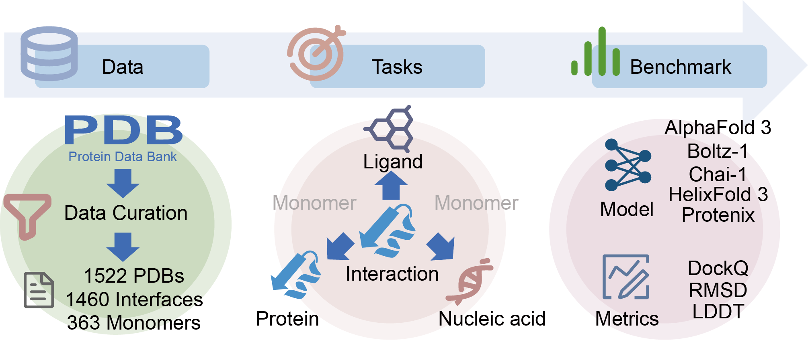

# FoldBench: An All-atom Benchmark for Biomolecular Structure Prediction




FoldBench is a low-homology benchmark that spans proteins, nucleic acids, ligands, and six major interaction types, enabling assessments that were previously infeasible with task-specific datasets.

## Leaderboard

### Protein Interactions

| Model | Protein-Protein | Antibody–Antigen | Protein-Ligand |
|:--------------:|:--------------:|:-----:|:--------------:|
| AlphaFold 3    | 72.92%          | 47.90%  | 64.90%           |
| Boltz-1        | 68.25%          | 33.54% | 55.04%          |
| Chai-1         | 68.53%          | 23.64% | 51.23%          |
| HelixFold 3    | 66.27%          | 28.40%  | 51.82%          |
| Protenix       | 68.18%          | 34.13% | 50.70%           |

### Nucleic acids

| Model | Protein-RNA | Protein-DNA | RNA Monomer | DNA Monomer |
|:--------------:|:-----------:|:-----------:|:-----------:|:-----------:|
| AlphaFold 3    | 62.32%       | 79.18%       | 61.40%        | 52.78%        |
| Boltz-1        | 56.90%       | 70.97%       | 44.16%        | 33.88%        |
| Chai-1         | 50.91%       | 69.97%       | 48.52%        | 45.74%        |
| HelixFold 3    | 48.28%       | 50.00%       | 54.87%        | 29.09%        |
| Protenix       | 44.78%       | 68.39%       | 59.03%        | 43.84%        |

**Note:**
- Interface prediction is evaluated by success rate.
- Monomer prediction is evaluated by LDDT.
- Success is defined as:
  - For protein–ligand interfaces: LRMSD < 2 Å and LDDT-PLI > 0.8
  - For all other interfaces: DockQ ≥ 0.23


## Acknowledgement
We gratefully acknowledge the developers of the following projects:
+ [Alphafold3](https://github.com/google-deepmind/alphafold3)
+ [Protenix](https://github.com/bytedance/Protenix)
+ [Chai-1](https://github.com/chaidiscovery/chai-lab)
+ [Boltz-1](https://github.com/jwohlwend/boltz)
+ [Helixfold3](https://github.com/PaddlePaddle/PaddleHelix/tree/dev/apps/protein_folding/helixfold3)
+ [Openstructure](https://git.scicore.unibas.ch/schwede/openstructure)
+ [DockQ](https://github.com/bjornwallner/DockQ)

## Cite
If you use FoldBench in your research, please cite:
```bibtex
@article {Xu2025.05.22.655600,
	author = {Xu, Sheng and Feng, Qiantai and Qiao, Lifeng and Wu, Hao and Shen, Tao and Cheng, Yu and Zheng, Shuangjia and Sun, Siqi},
	title = {FoldBench: An All-atom Benchmark for Biomolecular Structure Prediction},
	year = {2025},
	doi = {10.1101/2025.05.22.655600},
	journal = {bioRxiv}
}
```


