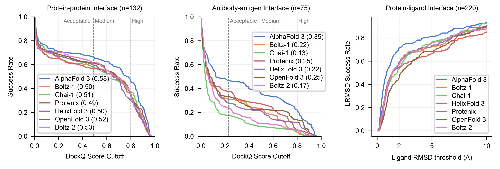

# Benchmarking all-atom biomolecular structure prediction with FoldBench


FoldBench is a low-homology benchmark spanning proteins, nucleic acids, ligands, and six major interaction types, enabling assessments that were previously infeasible with task-specific datasets.

## 📢 Updates
+ **2025-12-05**: The evaluation results for Boltz-2 and OpenFold3-preview have been updated.
+ **2025-12-04**: FoldBench has been published in [Nature Communications](https://www.nature.com/articles/s41467-025-67127-3).

## 🎯 FoldBench Targets
The FoldBench benchmark targets are open source. This comprehensive dataset, located in the `targets` directory, is organized into two primary collections:

### **Interfaces**

* **Protein–Protein:** 279 interfaces,
* **Antibody–Antigen:** 172 interfaces
* **Protein–Ligand:** 558 interfaces
* **Protein–Peptide:** 51 interfaces
* **Protein–RNA:** 70 interfaces
* **Protein–DNA:** 330 interfaces

### **Monomeric Structures**

* **Protein Monomers:** 330 structures
* **RNA Monomers:**  15 structures
* **DNA Monomers:** 14 structures

## 🏆 Leaderboard

**Evaluation Metrics:** Interface prediction tasks are evaluated by success rate, while monomer prediction tasks use LDDT (Local Distance Difference Test) scores. All results are based on comprehensive evaluations across our low-homology benchmark dataset.

### Results on targets released after 2023-01 (full set)
#### Protein Interactions

| Model | Protein-Protein | Antibody–Antigen | Protein-Ligand |
|:--------------:|:--------------:|:-----:|:--------------:|
| AlphaFold 3    | 72.93%          | 47.90% | 64.90%          |
| Boltz-1        | 68.25%          | 33.54% | 55.04%          |
| Chai-1         | 68.53%          | 23.64% | 51.23%          |
| HelixFold 3    | 66.27%          | 28.40% | 51.82%          |
| Protenix       | 68.18%          | 34.13% | 50.70%          |
| OpenFold 3 (preview)     | 69.96%          | 28.83% | 44.49%          |

#### Nucleic acids

| Model | Protein-RNA | Protein-DNA | RNA Monomer | DNA Monomer |
|:--------------:|:-----------:|:-----------:|:-----------:|:-----------:|
| AlphaFold 3    | 62.32%       | 79.18%       | 0.61         | 0.53         |
| Boltz-1        | 56.90%       | 70.97%       | 0.44         | 0.34         |
| Chai-1         | 50.91%       | 69.97%       | 0.49         | 0.46         |
| HelixFold 3    | 48.28%       | 50.00%       | 0.55         | 0.29         |
| Protenix       | 44.78%       | 68.39%       | 0.59         | 0.44         |
| OpenFold 3 (preview)    | 18.84%       | 5.88%        | 0.63         | 0.51         |

### Results on targets released after 2024-01
#### Protein Interactions
| Model | Protein-Protein | Antibody–Antigen | Protein-Ligand |
|:--------------:|:--------------:|:-----:|:--------------:|
| AlphaFold 3    | 70.87%          | 47.95% | 67.59%          |
| Boltz-1        | 64.10%          | 31.43% | 51.33%          |
| Chai-1         | 66.95%          | 18.31% | 49.28%          |
| HelixFold 3    | 66.67%          | 28.17% | 50.68%          |
| Protenix       | 64.80%          | 38.36% | 53.25%          |
| OpenFold 3 (preview)     | 68.22%          | 34.29% | 40.85%          |
| Boltz-2*       | 70.54%          | 25.00% | 53.90%          |


#### Nucleic acids

| Model | Protein-RNA | Protein-DNA |
|:--------------:|:-----------:|:-----------:|
| AlphaFold 3    | 72.50%       | 80.45%       | 
| Boltz-1        | 70.00%       | 69.77%       |
| Chai-1         | 55.56%       | 69.14%       | 
| HelixFold 3    | 54.29%       | 61.18%       | 
| Protenix       | 56.41%       | 67.63%       | 
| OpenFold 3 (preview)     | 25.00%       | 5.81%        |
| Boltz-2*       | 76.92%       | 73.84%       |


*Models marked with * have a training cutoff later than FoldBench's reference date (2023-01-13). FoldBench targets are constructed to ensure **low homology specifically against the PDB data prior to 2023-01-13**. Consequently, models trained on data released after this date may have observed these targets or their close homologs during training (potential data leakage), compromising the low-homology evaluation condition. Results for these models are provided for reference only and should not be directly compared with strictly valid models.

**Nucleic acid monomer results are omitted due to insufficient target availability. 

**Note:**
- Interface prediction is evaluated by success rate.
- Monomer prediction is evaluated by LDDT.
- Success is defined as:
  - For protein–ligand interfaces: LRMSD < 2 Å and LDDT-PLI > 0.8
  - For all other interfaces: DockQ ≥ 0.23
- We developed an algorithm to identify and prevent overfitting of models on FoldBench, ensuring fair and reliable evaluation.

## 📈 Detailed Performance Analysis

### Results on targets released after 2023-01 (full set)


### Results on targets released after 2024-01


## 🚀 Getting Started

To get started with FoldBench, clone the repository and set up the Conda environment.

```bash
# 1. Clone the repository
git clone https://github.com/BEAM-Labs/FoldBench.git
cd FoldBench

# 2. Create and activate the Conda environment for evaluation
conda env create -f environment.yml
conda activate foldbench
```

## ⚙️ Evaluation
You can use our provided evaluation samples to reproduce the evaluation workflow. The final results will be generated in `examples/summary_table.csv`.

```bash
# Ensure you are in the FoldBench root directory and the conda environment is active

# Step 1: Calculate per-target scores from prediction files
# This uses OpenStructure (ost) and DockQ to score each prediction against its ground truth
python evaluate.py \
  --targets_dir ./examples/targets \
  --evaluation_dir ./examples/outputs/evaluation \
  --algorithm_name Protenix \
  --ground_truth_dir ./examples/ground_truths

# Step 2: Aggregate scores and calculate the final success rates/LDDT
# This summarizes the results for specified models and tasks into a final table
python task_score_summary.py \
  --evaluation_dir ./examples/outputs/evaluation \
  --target_dir ./examples/targets \
  --output_path ./examples/summary_table.csv \
  --algorithm_names Protenix \
  --targets interface_protein_ligand interface_protein_dna monomer_protein \
  --metric_type rank
```

### Evaluate more structures
To evaluate more structures in FoldBench, you'll need to follow these steps:

#### **1. Prepare Your Data**

* **Edit the target CSV files:** Modify the CSV files located in the `examples/targets` directory. These files should contain information about the structures you want to evaluate.
* **Download ground truth CIF files:** A package containing the specific original CIF files referenced during the benchmark's creation is available for download here: [FoldBench Referenced CIFs](https://drive.google.com/file/d/17KdWDXKATaeHF6inPxhPHIRuIzeqiJxS/view?usp=sharing). Save these files in the `examples/ground_truths` directory. Ensure the filenames correspond to your data in the CSV files.


#### **2. Update Evaluation Outputs**

* **Modify `prediction_reference.csv`:** After preparing your data, you'll need to adjust the `./outputs/evaluation/{algorithm_name}/prediction_reference.csv` file to specify the model's ranking scores and the paths to the predicted structures. Please refer to the **[Integrating a New Model into FoldBench](./algorithms/README.md)**.


## ✨ Integrating a New Model into FoldBench

We enthusiastically welcome community submissions!

You can submit your algorithm for us to run the tests.

For detailed instructions on how to package your model for submission, please see the contributor's guide:
**[Integrating a New Model into FoldBench](./algorithms/README.md)**.


## 🏠 Repository Structure

The FoldBench repository is organized to separate benchmark data, evaluation code, and evaluation samples. 

```
FoldBench/
├── targets/               # FoldBench targets csv files
│   ├── interface_antibody_antigen.csv
│   └── ...
├── algorithms/
│   ├── algorithm_name/              # Custom model's code and definition files go here
│   └── ...
├── examples/
│   ├── outputs/
│   │   ├── input/                   # Preprocessed inputs for each algorithm
│   │   │   └── algorithm_name/
│   │   ├── prediction/              # Model predictions (e.g., .cif files)
│   │   │   └── algorithm_name/
│   │   └── evaluation/              # Final scores and summaries
│   │       └── algorithm_name/
│   ├── targets/                     # Target definitions
│   ├── ground_truths/               # Ground truth cif files
│   └── alphafold3_inputs.json       # Alphafold3 input json
├── build_apptainer_images.sh        # Script to build all algorithm containers
├── environment.yml                  # Conda environment for evaluation scripts
├── run.sh                           # Master script to run inference and evaluation
├── evaluate.py                      # Prediction evaluation
├── task_score_summary.py            # Benchmark score summary
└── ...
```

## 🙏 Acknowledgements

We gratefully acknowledge the developers of the following projects, which are essential to FoldBench:

+ [Alphafold3](https://github.com/google-deepmind/alphafold3)
+ [Protenix](https://github.com/bytedance/Protenix)
+ [Chai-1](https://github.com/chaidiscovery/chai-lab)
+ [Boltz-1/2](https://github.com/jwohlwend/boltz)
+ [Helixfold3](https://github.com/PaddlePaddle/PaddleHelix/tree/dev/apps/protein_folding/helixfold3)
+ [OpenFold 3](https://github.com/aqlaboratory/openfold-3)
+ [OpenStructure](https://git.scicore.unibas.ch/schwede/openstructure)
+ [DockQ](https://github.com/bjornwallner/DockQ)

## 📄 License

This project is licensed under the MIT License - see the [LICENSE](LICENSE) file for details.

The MIT License is a permissive open source license that allows for commercial and non-commercial use, modification, distribution, and private use of the software, provided that the original copyright notice and license terms are included.

## ✍️ How to Cite

If you use FoldBench in your research, please cite our paper:

```bibtex
@article{xu_benchmarking_2025,
	title = {Benchmarking all-atom biomolecular structure prediction with {FoldBench}},
	issn = {2041-1723},
	url = {https://doi.org/10.1038/s41467-025-67127-3},
	doi = {10.1038/s41467-025-67127-3},
	journal = {Nature Communications},
	author = {Xu, Sheng and Feng, Qiantai and Qiao, Lifeng and Wu, Hao and Shen, Tao and Cheng, Yu and Zheng, Shuangjia and Sun, Siqi},
	month = dec,
	year = {2025},
}
```


